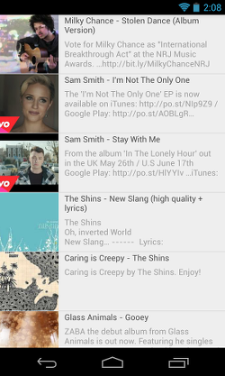

android-youtube-listview
============

Android widget which allows easy embedding of youtube videos into your application.



TODO
-------

* Save state on rotation


Download
-------

Via Gradle
```groovy
compile('com.laimiux:android-youtube-listview:0.1.1@aar') {
    transitive = true;
}
```

[](https://android-arsenal.com/details/1/1112)

